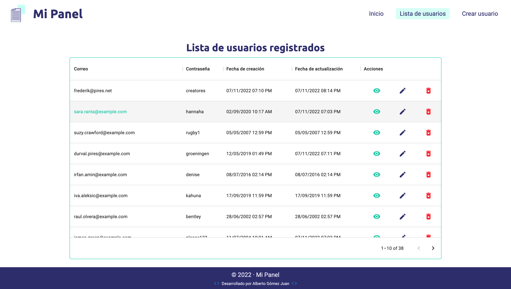
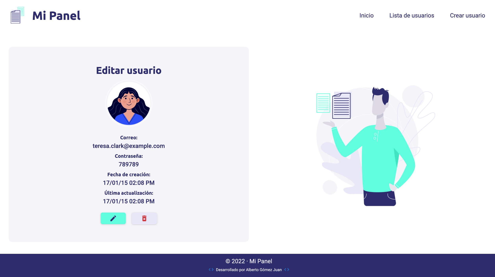
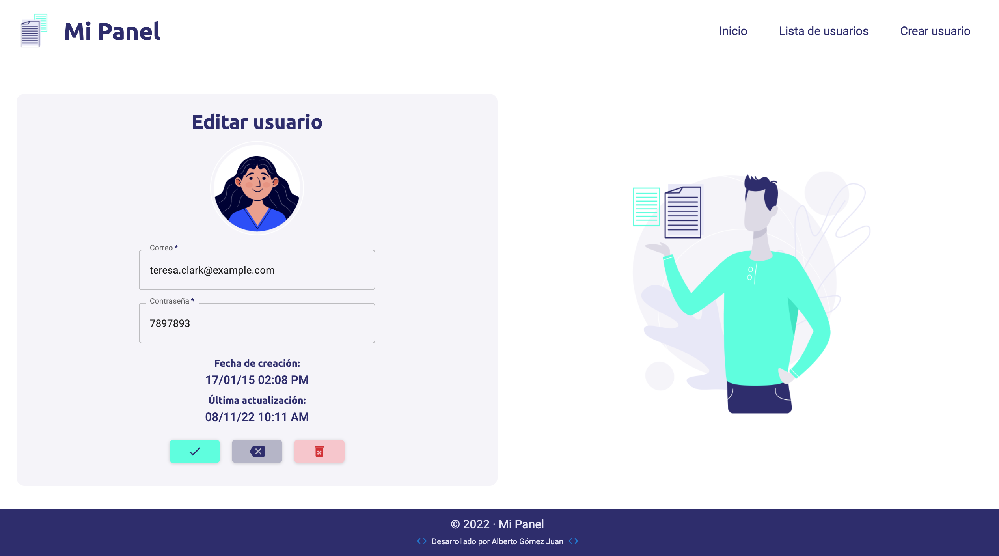
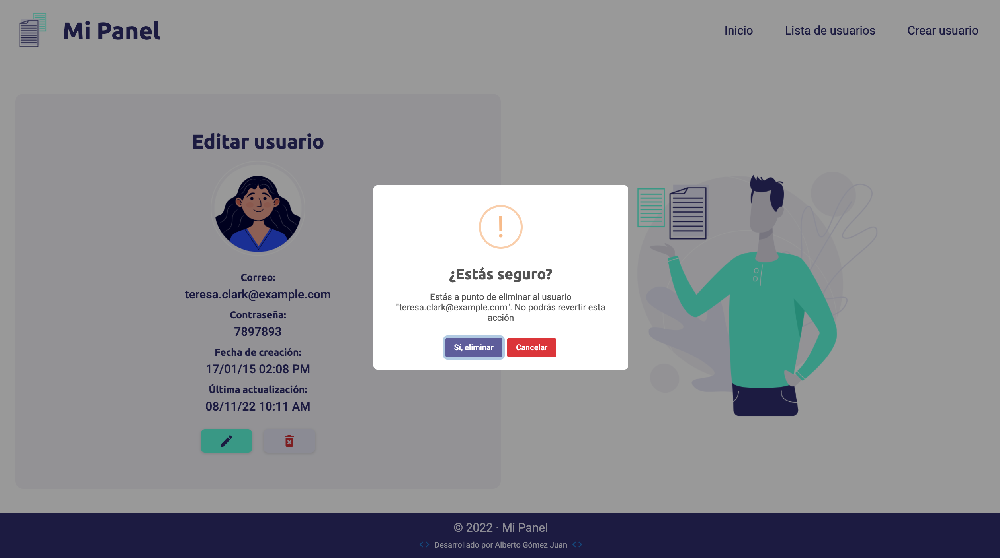

# Panel de Administración de Usuarios

Esta app fue realizada como prueba de nivel de React para acceder a la vacante de desarrollador Frontend en [Wipay](https://wipay.es/).

Es un panel de administración de usuarios que contempla las operaciones básicas de tipo CRUD (Create, Read, Update, Delete). Contiene las siguientes funcionalidades:

1. Una pantalla inicial donde se muestre el número total de usuarios actuales.
   
2. Una pantalla para visualizar el listado de usuarios.
   
3. Una pantalla para visualizar los datos de un usuario.
   
4. Una pantalla para editar los datos de un usuario.
   
5. Un botón de acción para eliminar el usuario.

   - Dicho botón pregunta si se está seguro antes de eliminar el usuario.
   - Dicho botón aparece en el listado de usuarios, en la vista de detalles de usuario y en la vista de edición de usuario.

   

Un usuario contiene los siguientes atributos junto a sus validaciones:

1. Un correo electrónico:
   - De tipo String.
   - Debe comprobarse que sea un correo electrónico válido.
2. Una contraseña:
   - De tipo String.
   - Debe tener entre 6 y 12 caracteres de longitud.
3. Una fecha de creación:
   - De tipo Date.
4. Una fecha de última actualización:
   - De tipo Date.
   - Este valor debe actualizarse cada vez que se actualice un usuario.
   - Por defecto, tiene el mismo valor que la fecha de creación.

El proyecto fue desarrollado con [Create React App](https://github.com/facebook/create-react-app). Al descargarlo se debe ejecutar el comando `npm install` para instalar las dependencias.

## Dependencias utilizadas

- React Router
- Material UI
- Lodash
- Moment
- React Hook Form
- Sass
- Sweet Alert 2
- uuid v4
- validator

## Scripts disponibles

En el directorio del proyecto puedes ejecutar:

### `npm start`

Ejecuta la aplicación en modo desarrollador.\
Abrir [http://localhost:3000](http://localhost:3000) para verla en el navegador.
